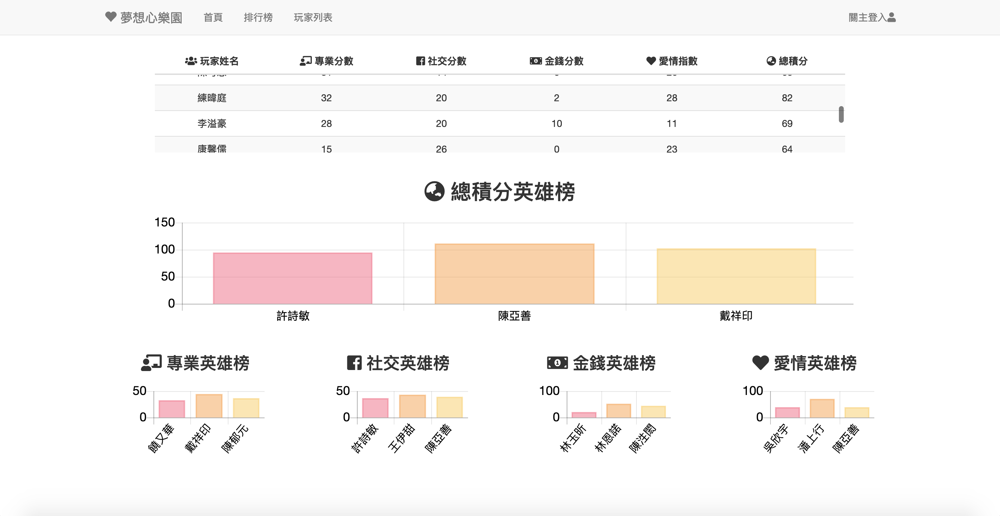
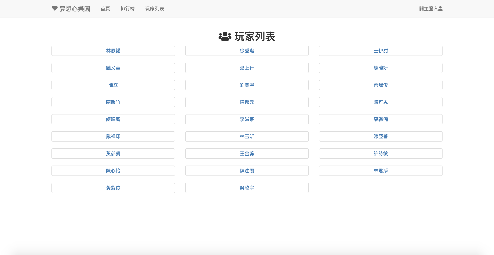
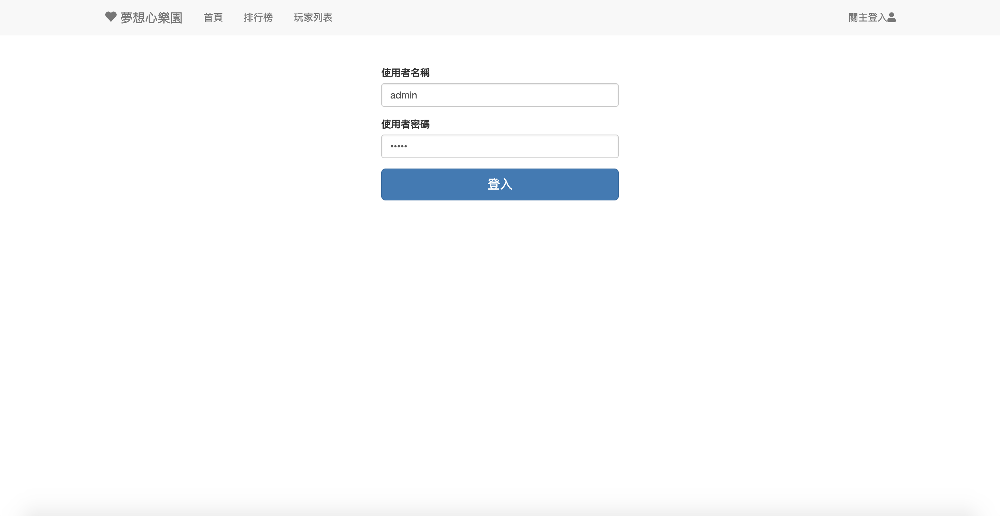
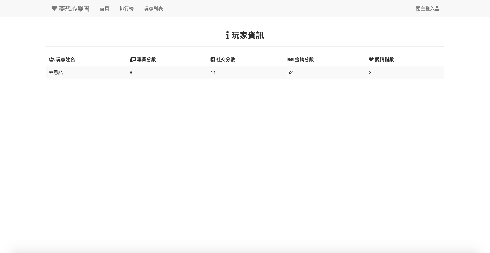
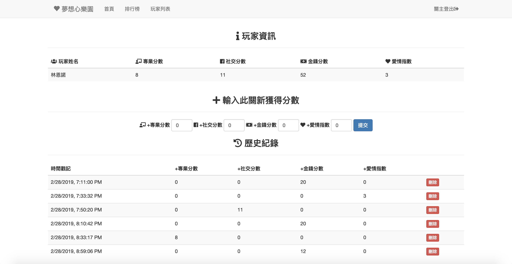

# WebScoreBoard
These code can boost field game by recording players' score and show leaderboard.
## Demo
### Landpage

### Dashboard

### Player List Page

### Login Page(default account and password are `admin`)

### Player's Profile(before login)

### Player's Profile(after login)



## Get Started
* Prepare `nginx.conf` file (at `/usr/local/etc/nginx.conf` in Mac OS Mojave)
Change server block as below:

```
server {
    listen       80;
    server_name  www.dreamheart.life;

    #charset koi8-r;

    #access_log  logs/host.access.log  main;

    location / {
        proxy_pass http://127.0.0.1:3000;
    }
```

* cd into WebScoreBoard folder

```
cd WebScoreBoard
```
* Install dependencies

```
npm install
```
* Open mongodb daemon

```
mongod
```
* Init Database

```
node initDB.js
```
* Run node app

```
node app.js
```


## Prerequisite
See package.json
* bootstrap 3.4

* fontawesome 5.7.1

* jquery 3.3.1

* Node.js v10.15.1

* npm v6.4.1

* express 4.16.4

* express-session 1.15.6

* ejs 2.6.1

* bodyParser 1.18.3

* mongoose 5.4.10

* passport 0.4.0

* passport-local 1.0.0

* chart.js 2.7.3


## TODO:
* Dockerize it
* Use pm2  

## Authors
* [jimlinntu](https://github.com/jimlinntu)